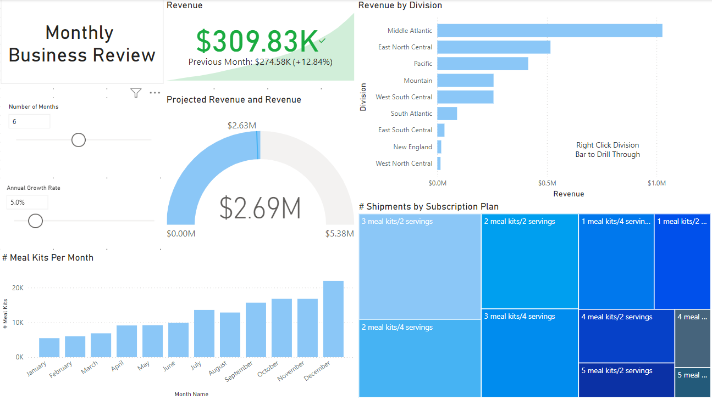
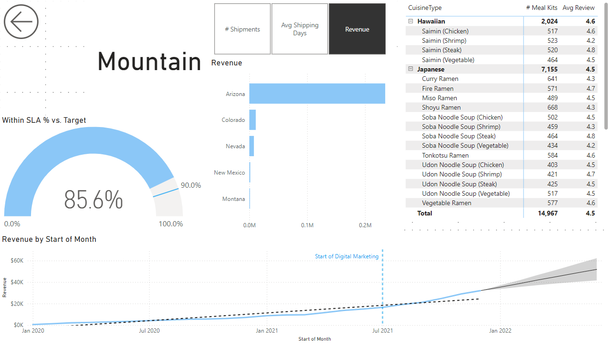

# Power-BI-Business-Dashboard
Power BI Dashboard developed through the Power BI course by Travis Cuzick

This repository contains a Power BI dashboard designed for analyzing business performance, including revenue, shipping, and future projections.

## Dashboard Overview

### Page 1: Monthly Business Review

This page focuses on revenue, shipping performance, and detailed cuisine data for the Mountain Division. Users can interact with visuals to drill through to specific division details.

### Page 2: Division Insights

This page provides an overview of business performance across divisions, projected revenue, and customer subscription trends. The "Revenue by Division" bar chart allows users to drill through to more details.

